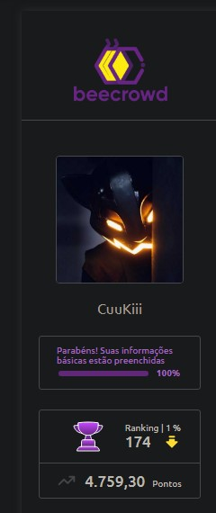
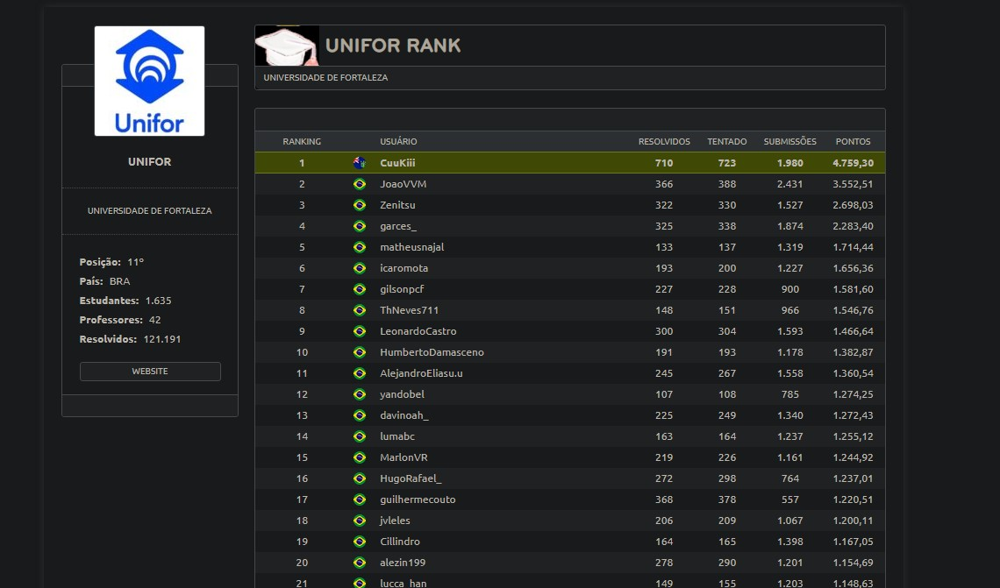

<h1 align="center">🐝 BeeCrowd (URI Online Judge) – Soluções</h1>

<p align="center">
  
  
  
</p>

---

## 📌 Sobre o Projeto
Este repositório contém minhas soluções para os problemas da plataforma **[BeeCrowd](https://www.beecrowd.com.br/judge/pt)** (antigo URI Online Judge).  
O objetivo é servir como **guia de estudos** em lógica de programação e algoritmos.

---

## 📂 Estrutura do Repositório
```
📦 uri-online-judge-BeeCrowd
┣ 📂 javascript → soluções em JavaScript
┣ 📂 java → soluções em Java
┣ 📜 README.md
┗ 📜 LICENSE
Cada arquivo tem o nome correspondente ao **ID do problema** no BeeCrowd  
(exemplo: `1000.js` ou `1000.java` → problema nº 1000).
```
---

## 🛠️ Tecnologias Utilizadas
- ⚡ **JavaScript**  
- ☕ **Java**

---

## 👤 Meu Perfil BeeCrowd

<p align="center">
  <a href="https://judge.beecrowd.com/pt/profile/619634">
   
  </a>
  <a href="https://judge.beecrowd.com/pt/users/university/unifor">
    
  </a>
</p>

<p align="center">
  <a href="https://judge.beecrowd.com/pt/profile/619634">Clique aqui para acessar meu perfil no BeeCrowd</a>
</p>
 
